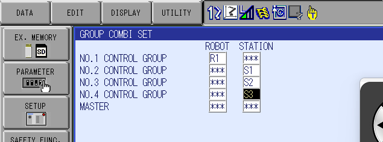

This particular job configuration is for use with a system that is configured with the `Control Group Extension` function (allow more than two groups in a job). 
If this function is enabled, the `Group Combination` screen should look like the image shown in `Group_Combination_Settings.png`.

If this screen only shows two groups, then the `Control Group Extension` function is not enabled and the `.JBI` in this directory should not be used.
